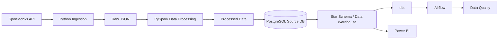

# ⚽ Football Data Engineering Platform

An end-to-end **Football Data Engineering & Analytics Platform** built to simulate a real-world data pipeline — from API ingestion and data processing to a PostgreSQL Data Warehouse, dbt transformations, Airflow orchestration, data quality checks, and Power BI analytics.

---

## 🏗️ Architecture



---

## 🚀 Project Overview

The platform collects football data from the **SportMonks Football API**, processes and transforms the data using **Python and PySpark**, stores the processed source data in **PostgreSQL**, builds a dimensional Data Warehouse using a **Star Schema**, applies analytical transformations with **dbt**, orchestrates the pipeline with **Apache Airflow**, validates data quality, and exposes the final data through **Power BI**.

The project is designed around a production-style data engineering workflow rather than a simple analytics script.

---

## 🧩 Pipeline Stages

### 1. Data Ingestion

Football data is collected from the SportMonks API using Python.

Main entities:

* Leagues
* Teams
* Players
* Fixtures
* Fixture Events

The ingestion layer stores the raw API responses before processing.

---

### 2. Data Processing with PySpark

PySpark is used to transform and standardize the incoming football data.

Processing includes:

* Schema normalization
* Data type conversion
* Null handling
* Column standardization
* Event transformation
* Fixture enrichment
* Preparation of analytical datasets

Processed data is prepared for loading into PostgreSQL.

---

### 3. PostgreSQL Source Database

The processed football data is loaded into PostgreSQL.

Main source tables:

```text
leagues
teams
players
fixtures
fixture_events
```

Relationships are validated to ensure referential integrity between:

* Fixtures → Leagues
* Fixtures → Teams
* Events → Fixtures
* Events → Players

---

## 🏢 Data Warehouse

A dedicated PostgreSQL Data Warehouse database is used for analytical workloads.

Database:

```text
football_dw
```

The warehouse follows a **Star Schema** design.

### Dimension Tables

```text
dim_date
dim_league
dim_team
dim_player
```

### Fact Tables

```text
fact_fixtures
fact_fixture_events
```

### Star Schema

```text
                    ┌──────────────┐
                    │   dim_date   │
                    └──────┬───────┘
                           │
                           │
┌──────────────┐     ┌────▼─────────────┐     ┌──────────────┐
│ dim_league   │────▶│  fact_fixtures   │◀────│   dim_team   │
└──────────────┘     └────┬─────────────┘     └──────────────┘
                           │
                           │
                    ┌──────▼──────────┐
                    │ fact_fixture    │
                    │     events      │
                    └──────┬──────────┘
                           │
                    ┌──────▼──────────┐
                    │   dim_player    │
                    └─────────────────┘
```

---

## 🔄 dbt Transformation Layer

dbt is used to create the analytical layer on top of the PostgreSQL Data Warehouse.

### Staging Models

```text
stg_dates
stg_fixture_events
stg_fixtures
stg_leagues
stg_players
stg_teams
```

### Mart Models

```text
fct_matches
fct_player_events
```

dbt is also used for:

* Data modeling
* SQL transformations
* Data tests
* Analytical marts

The final dbt build completed successfully:

```text
22 PASS
0 WARN
0 ERROR
0 SKIP
```

---

## ⚙️ Apache Airflow

Apache Airflow orchestrates the end-to-end data pipeline.

Main DAG:

```text
football_data_pipeline
```

Pipeline flow:

```text
API / Existing Data
        │
        ▼
    Ingestion
        │
        ▼
    PySpark
        │
        ▼
   PostgreSQL
        │
        ▼
 Data Warehouse
        │
        ▼
      dbt
        │
        ▼
 Data Quality
```

Airflow is responsible for scheduling and coordinating the different pipeline stages.

---

## ✅ Data Quality

A dedicated data quality layer validates the warehouse before analytics.

Current validation results:

| Table               | Rows |
| ------------------- | ---: |
| dim_date            |  365 |
| dim_league          |    4 |
| dim_team            |   12 |
| dim_player          |  338 |
| fact_fixtures       |  132 |
| fact_fixture_events |  907 |

Quality checks include:

* Duplicate fixture detection
* NULL fixture ID validation
* Orphan event detection
* Referential integrity checks
* Warehouse row-count validation

Final status:

```text
DATA QUALITY: PASSED
```

---

## 📊 Power BI Analytics

The final warehouse is connected to Power BI for football analytics.

### Dashboard Pages

#### 1. Overview

Provides high-level KPIs:

* Total Matches
* Total Events
* Total Teams
* Total Players
* Total Leagues
* Average Events per Match
* Match Results
* Team Event Activity

#### 2. Match Analytics

Includes:

* Matches by Week
* Events Distribution by Team
* Events by Match Minute
* Match Results
* Events by Result Type

#### 3. Player Analytics

Includes:

* Top Players by Events
* Player Event Contribution by Type
* Average Events per Player
* Player Activity Over Time
* Player Performance Table

#### 4. Data Quality & Executive Insights

Includes:

* Data Quality KPIs
* Average Events per Match Over Time
* Event Coverage
* Top Teams by Events
* Detailed Match & Events Data

---

## 📈 Key Power BI Measures

```DAX
Total Matches = COUNTROWS(fact_fixtures)
```

```DAX
Total Events = COUNTROWS(fact_fixture_events)
```

```DAX
Avg Events per Match =
DIVIDE(
    [Total Events],
    [Total Matches]
)
```

```DAX
Matches with Events =
DISTINCTCOUNT(fact_fixture_events[fixture_key])
```

```DAX
Event Coverage % =
DIVIDE(
    [Matches with Events],
    [Total Matches]
)
```

---

## 🛠️ Technology Stack

| Layer           | Technology              |
| --------------- | ----------------------- |
| Data Source     | SportMonks Football API |
| Ingestion       | Python                  |
| Processing      | PySpark                 |
| Source Database | PostgreSQL              |
| Data Warehouse  | PostgreSQL              |
| Data Modeling   | Star Schema             |
| Transformation  | dbt                     |
| Orchestration   | Apache Airflow          |
| Containers      | Docker                  |
| Analytics       | Power BI                |
| Version Control | Git / GitHub            |
| Environment     | WSL                     |

---

## 📁 Project Structure

```text
football-data-platform/
│
├── airflow/
│   ├── dags/
│   ├── quality/
│   ├── Dockerfile
│   └── docker-compose.yml
│
├── dbt/
│   └── football_dbt/
│       ├── models/
│       │   ├── staging/
│       │   └── marts/
│       ├── macros/
│       ├── tests/
│       └── dbt_project.yml
│
├── ingestion/
│   ├── fetch_leagues.py
│   ├── fetch_teams.py
│   ├── fetch_players.py
│   ├── fetch_fixtures.py
│   ├── fetch_fixture_events.py
│   └── load_*_to_postgres.py
│
├── processing/
│   ├── transform_leagues.py
│   ├── transform_teams.py
│   ├── transform_players.py
│   ├── transform_fixtures.py
│   ├── transform_events.py
│   └── transform_fixtures_enriched.py
│
├── warehouse/
│   └── sql/
│       ├── 01_create_dim_date.sql
│       ├── 02_create_dim_league.sql
│       ├── 03_create_dim_team.sql
│       ├── 04_create_dim_player.sql
│       ├── 05_create_fact_fixtures.sql
│       ├── 06_create_fact_fixture_events.sql
│       └── 07_create_indexes.sql
│
├── docker-compose.yml
├── test_api.py
├── test_postgres.py
└── .gitignore
```

---

## 🔐 Security

Secrets and local environment files are intentionally excluded from GitHub.

The repository ignores:

```text
.env
.venv/
dbt_profiles/
data/raw/
data/processed/
__pycache__/
Airflow logs
dbt target files
```

API tokens, database passwords, and local credentials are **not committed to the repository**.

---

## 🎯 Project Outcome

This project demonstrates a complete modern data engineering workflow:

```text
Raw Data
   ↓
Ingestion
   ↓
Transformation
   ↓
PostgreSQL
   ↓
Data Warehouse
   ↓
dbt
   ↓
Airflow
   ↓
Data Quality
   ↓
Power BI
```

It combines data engineering, analytics engineering, orchestration, data quality, dimensional modeling, and BI into one end-to-end football data platform.

---

## 👨‍💻 Author

**Ali Rabea Ahmed**

Data Analyst | Data Engineering Enthusiast

GitHub:

https://github.com/ali1234554321t-cpu

---

